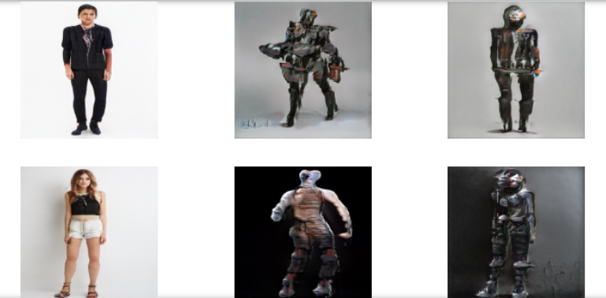

# CYBORG IMAGE GENERATOR

This project is an implementation of StyleGAN. Two models are trained on images of humans and robots respectively. Then a hybrid model is obtaind by swapping the layers. This hybrid model generates cyborg images.

##Dependencies

* Python >3.6
* Pytorch 
* StyleGAN2